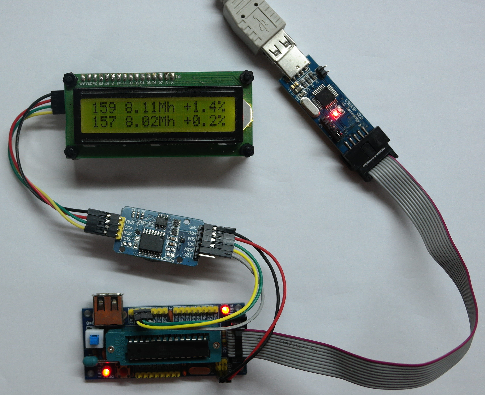

```
 First Line: Factory OSCCAL=159 Frequency=8.11Mhz Error = +1.4%
Second Line: Optimal OSCCAL=157 Frequency=8.02Mhz Error = +0.2%
```

# rcCalibrator
Calibration of the internal RC oscillator of atmega328p chip, and OSCCAL aware Serial bootloader(ATmegaBOOT).
The hardware consists of a USBasp programmer and a DS3231 module, and of course the programmer can be
used for its normal purpose to flash the chips. The LCD is optional.To bypass the documentation go
down to [installation](#software-installation)

### WARNING
The use of this utility will erase all the contents of your MCU without notice.
Use it only if you are familiar with ISP programming and know how to set the chip to the old state.

### WARNING 2
57600 and even more 115200 is somewhat problematic. See the section "57600bps"

### The problem
Most of the projects using atmega328p (including arduino boards), have a crystal or resonator connected to pins XTAL1 and XTAL2.
If you don't mind to run at 8Mhz, you can use FUSE settings to set the MCU to use its internal RC oscillator.<br/>
The problem is however that
the RC oscillator is sometimes not very well calibrated.
At least for atmega328p the frequency can deviate up to
10% from the 8Mhz (usually 0-3% and to be fair, most of the time, very close to 0%). This is a problem for
Serial communications, which tolerate up to ~2-3% error.
The AVR microcontrollers have a register called OSCCAL (Oscillator Calibration) which can
be used to drift the RC frequency and reduse the error to less than 1%.

### The purpose of this project
There are a lot of pages to address the calibration problem, and atmel has released a lot of
related papers. This project aims to offer an alternative solution :
- To find the optimal OSCCAL value, using an ISP programmer and a DS3231 rtc module.
- **More importantly** to provide a mechanism via the "osccal" utility to automatically build bootloader and
application code capable of fixing the RC frequency.

### Serial communication problems
The use of Serial communications is a basic reason why we need a calibrated RC oscillator. Introduces
another type of error though, because the 8MHz clock speed is not divided exactly with the standard
serial bitrates. See [WormFood calculator](http://wormfood.net/avrbaudcalc.php) at 8Mhz

```
38400   +0.2%   This is an excellent choise when running at 8Mhz
57600   +2.1%   The proMinis(3.3V 8Mhz) are capable of this serial speed
115200  -3.5%   This is the reason ProMini@8Mhz cannot do 115.2k
```

### Serial bootloader: Even more problems, and a solution.
The use of a Serial/UART bootloader (a standard, not the one provided here) and at the same time using the internal RC
oscillator, is a subtle problem. Suppose we know that the optimal
OSCCAL value for a specific atmega chip is 139 : We develop an Arduino application,
and right after setup() we have:

```C++
OSCCAL=139;
```

Seems good ?<br/>
**Unfortunately it wont help.**<br/>
The bootloader starts first, without knowing anything about the magic 139 value, and happily
waits for code from the UART.
If the chip happens to be
badly factory calibrated, the serial communication will fail and we will not be able to upload any code to the chip.

The solution provided here is simple and very robust. "osccal"
utility finds the  correct OSCCAL value, and then the (modified)ATmegaBOOT is compiled
against this specific OSCCAL value. Then it is uploaded to the chip. The first
think the bootloader does, is to Fix the RC frequency, allowing serial communications. For another atmega chip
the OSCCAL value will be different, and so on.

### 57600bps
57600bps introduces +2.1% error. Suppose we have calibrated the RC oscillator and the error is
+0.3%. Then the total error becomes +2.4% which is big. I suggest if you really need to use
57600bps in your appplication to use an OSCCAL = OPTIMAL_OSCCAL - 4 to compensate the error.
The patched ATmegaBOOT provided, does exactly this, but before jump to the application it sets
the OSCCAL to the optimal value, because it does not know which speed the application uses.
In that case a "OSCCAL-=4;" does the job

### Reasons to use an external crystal
- Generally whenever you need better accuracy than the RC oscillator can
provide. Anything more accurate than 1% should be done with external crystal/resonator<br/>
- If you need the speed (up to 20Mhz).<br/>
- When the trouble to calibrate the RC oscillator outweighs
the trouble to install the crystal.<br/>
I believe using the "osccal" utility, it is much easier (or at least, this is my intention) to have a calibrated
atmega with a perfectly working bootloader, than to install the crystal. "make isp" is all it is needed.

### Reasons to use the internal oscillator

- Fewer parts on the breadboard/PCB. This
is usually the first reason that comes in mind, but it is also the least importand.
A crystal is usually a tiny part of the complexity and the cost of
a project. For simple projects is fine however, if we can avoid the crystal.
- Ability to change the frequency at runtime. For example we can drift
the 8Mhz frequency -2.1% for extremely reliable 57600 serial communication and
drift it +3.5% for 115200. Of course we can calibrate the RC oscillator to
the Serial friendly 7.37(28) Mhz frequency. Note however that if you write
Arduino code, better use 8Mhz. A lot of
useful Arduino functions like millis() work correctly only for 8Mhz and 16Mhz
- You have 2 additional GPIO pins. The XTAL1 and XTAL2 can be used for any purpose.
A lot of projects need a lot of GPIO pins, and 2 more pins
can make the difference.
- A lot of projects don't need any accuracy of RC oscillator.
- **Much faster startup from sleep mode.** This is the reason this project exists.
I have a project where the MCU is in sleep, it is connected to a GSM modem with
hardware serial(UART), and wakes up from an incoming SMS.
Here is the message we get, when the (calibrated) RC oscillator is in use.<br/>
**"+CMT: "+30691234567","pkar","17/06/18,08:10:41+12"**<br/>
Here is the message, if we use a crystal<br/>
**S��������b���ɉ,"17/06/18,09:51:13+12"**<br/>
The crystal needs a lot of time to stabilize it's frequency. As you can
see the incoming phone number is lost. Sometimes even the date and time.

- This one seems a little strange, but is totally valid. The internal oscillator
has a lot of [jitter](https://en.wikipedia.org/wiki/Jitter), making it an excellent source of randomness. In conjunction with the Watchdog
timer (which has its own RC oscillator), can be used to generate random numbers much faster than the
Crystal-Watchdog combination.

### How "osccal" utility works
When "osscal" utility runs, it installs the "calibrator.hex" file to the MCU. This code calculates the optimal OSCCAL, using the DS3231 RTC module as clock reference. If the LCD is installed, it displays the values to the tiny screen. Finally and most
importantly it saves the OSCCAL value as:

**EEPROM byte 0: 0x05<br/>
EEPROM byte 1: OSCCAL<br/>
EEPROM byte 2: 255-OSCCAL<br/>
EEPROM byte 3: 0x05**

After a few seconds "osccal" reads back the value from the EEPROM, and prints it
to the console.


### Assembling the hardware
Although the photo at the start of the page says it all, here are some instructions:
- You need a usbasp ISP programmer. I recommend to use a module with 3.3V/5V option and switch
it to the voltage you are going to run the atmega328 after the calibration.
Probably the voltage will be 3.3V as we talk about a 8Mhz system.
- a ZIF developer board and
- a DS3231 RTC module. You
- also need some female-female Dupont 2.54 cables, better to be sort.
- If you want visual feedback, you need also a 16x2 LCD and an LCD i2c adapter(search ebay), and to solder the secondary
i2c header of the DS3231 module. The LCD modules
come as 5V and 3.3V variants. Probably you need the 3.3V as mentioned above.

Developer Board | Rtc | LCD (if you use it) | Cable color
---|---|---|---
+/VCC  | VCC | VCC | Red
-/GND  | GND | GND | Black
PC4(Arduino A4)  |   SDA | SDA | Green
PC5(Arduino A5)  |   SCL | SCL | Yellow
PC3(Arduino A3)  |   SQW |   - | Gray


### Software installation
The following instructions are for the linux command line (debian, ubuntu, linux mint).
I suppose they can be adapted for Windows, but I didn't test it.

```sh
# The arduino development environment and the excellent Arduino-Makefile
> sudo apt-get install arduino-core arduino-mk
...
> cd ~/Projects  # Change with the directory you will put the rcCalibrator
> git clone https://github.com/pkarsy/rcCalibrator.git
> cd rcCalibrator
> chmod +x osccal
```

Optionally put he "osccal" executable to the PATH. In most desktop oriented distributions
a symlink is enough:
```sh
# if the ~/bin does not exist "mkdir ~/bin" and then logout and login again
> cd ~/bin
# Do NOT copy osccal, just symlink it
> ln -s ~/Projects/rcCalibrator/osccal
```

### How this project can be used

There are multiple strategies:
- To find some "good" atmegas and use them on serial applications. This of
course works only if you have a lot of atmegas and only some of them
need to be calibrated. This method has the advantage that no
modification of existing code is needed. If you need 57600 speed this
method is unreliable however. See "Serial communication problems" above. In fact
chips with about -1.5% to -2.5% error (Not 0% !) work the best for 57600bps.
- To be used with a custom bootloader who sets the OSCCAL register at
startup. I have modified the ATmegaBOOT (used in
Arduino proMini) to do exactly this. It sets the speed at about -2% (Reduces OSCCAL register by 4) of
the optimal 8Mhz value, to make 57600 upload very reliable because it conpensates the +2.1% error
(See "Serial communication problems" above) , and just
before the application code starts, sets the OSCCAL to the optimal
value for 8Mhz frequency, Although it can easily support 115200bps
by drifting the speed to +3.5% of the optimal, I
wanted it to be interchangeable with ProMini 3.3V@8Mhz  so you don't need to
define/use a custom board in the Arduino build system. "Standard is better than
better"

### Running the "osccal" utility standalone.
Connect the usbasp programmer (with the RTC) to a USB port,
attach a atmega chip, and run the executable :
```sh
# use the full path name ie "~/Projects/rcCalibrator/osccal" if 
# the executable is not in the PATH
> osccal
```
After a few seconds you will see the optimal osccal value in the command
line. If you have the LCD, you will also see the results there.
So from the perspective of the computer, "osccal" is a command witch
gives a number as a result (The best OSCCAL value = the closer to 8Mhz).

### Modified AtmegaBOOT installation
The process is quite automatic. Go to the folder where you downloaded rcCalibrator

```sh
> cd ATmegaBOOT
# The Makefile uses "osccal" utility to find the optimal OSCCAL value (using USBasp+RTC)
# Compiles the bootloader
# and uploads it (using the USBasp again)
> make isp
```

wait a few seconds ... ready !

It is important to note that the bootloader does NOT use any predefined
EEPROM or FLASH location to read the OSCCAL. This avoids the danger to accidentally erase
the EEPROM by the application (to store some data), with probably catastrophic results
for the project. The bootloader is recompiled for every
new chip and the OSCCAL value is saved in the bootloader
area and is unique for this chip. This is the reason there is no precompiled HEX for this
bootloader.

### Comparing ATmegaBoot(with OSCCAL support) with the stock ATmegaBOOT/optiboot
There are some pages around, that give instructions to use
an uncalibrated atmega328p with a 38400 bootloader(usually the stock optiboot or ATmegaBOOT). This is
unreliable however, as some chips come from the factory with clock errors
far worse than 2%. It is also non standard and requires an Arduino custom board definition (as far as I know).<br/>
The ATmegaBOOT Makefile included here, uses the "osccal" utility
to find the correct OSCCAL value. It compiles
the ATmegaBOOT against this value and then uploads the .hex file to the atmega328p chip. This chip
can then be used just like a proMini to upload code with 57600bps.
Indeed, according to my tests, the upload process is as reliable as with a crystal.

### rfboot
I have written the bootloader [rfboot](https://github.com/pkarsy/rfboot) which can (optionally) set the optimal OSCCAL value, before
jump to the application. The bootloader itself does not need any OSCCAL calibration to work (it uses SPI),
but the application might need it.

### applications without bootloader
You have to modify the Makefile of your project to use the "osscal" as a shell command and
get the OSCCAL value before write the application code. Somewhere inside the application
just after main() or setup() and before Serial initialization, put a

```C++
OSCCAL = CALIBRATED_OSCAL_VALUE;
```

CALIBRATED_OSCAL_VALUE must be passed to the gcc by the Makefile.
See the Makefile of the ATmegaBOOT bootloader, included here.

### Alternative method. Read the OSCCAL value from EEPROM
See [How "osccal" utility works](#how-osccal-utility-works) above.<br/>
The application reads the EEPROM and uses the OSCCAL value provided.
However I find the method quite fragile. A programming mistake can overwrite the contents
of the EEPROM.

